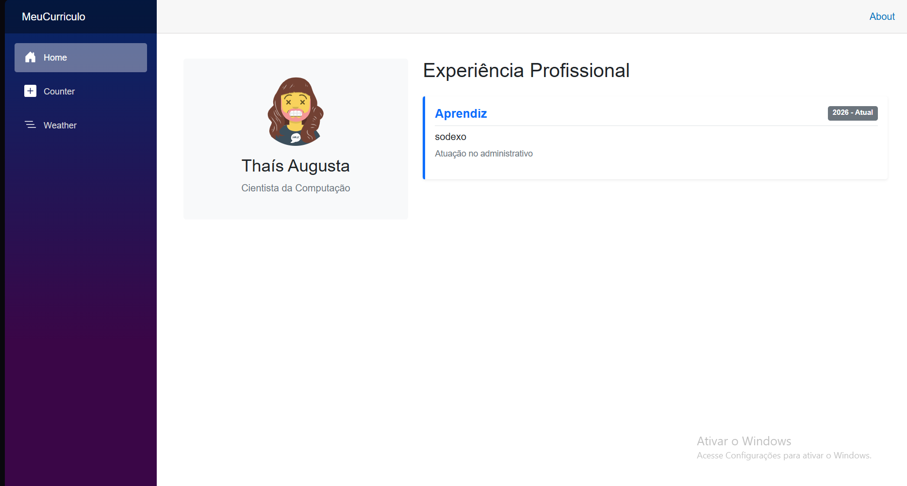

# Lista 14 — Currículo em Blazor

## Identificação

**Nome:** Thaís Augusta Pereira de Miranda  
**Curso:** Ciências da Computação  
**Instituição:** Centro Universitário UNA  
**Disciplina:** Interação Humano Computador e UX  
**Professor:** Daniel Henrique Matos de Paiva  

---

## Descrição do Projeto

Este projeto foi desenvolvido para a **Lista de Exercícios XIV**, com o objetivo de atualizar e personalizar uma aplicação de currículo feita em **Blazor**.

A ideia foi transformar o projeto feito em aula em uma página mais organizada e profissional, apresentando minhas informações de forma clara, como se fosse um currículo digital.

Foram feitos ajustes no layout, na organização dos conteúdos e na apresentação visual da aplicação.

---

## Objetivo

O objetivo principal da atividade foi refazer o layout da aplicação **MeuCurriculo Blazor** e adicionar informações profissionais do aluno.

A proposta também buscou aplicar conceitos de **IHC e UX**, deixando a navegação mais simples, a leitura mais fácil e as informações mais bem distribuídas na tela.

---

## Tecnologias Utilizadas

- C#
- .NET
- Blazor
- HTML
- CSS

---

## Como Executar o Projeto

Para executar o projeto pelo terminal, siga os passos abaixo:

### 1. Clonar o repositório

    git clone https://github.com/guilhermeahs/una-blazor-lista14.git

### 2. Acessar a pasta do projeto

    cd una-blazor-lista14

### 3. Restaurar os pacotes do projeto

    dotnet restore

### 4. Rodar a aplicação

    dotnet run

### 5. Abrir no navegador

Depois de rodar o comando, o terminal irá mostrar o endereço para acessar a aplicação.

Normalmente será parecido com:

    http://localhost:5000

ou

    https://localhost:5001

---

## Screenshot

---

## Heurística: Ajuda e Documentação

A heurística de **Ajuda e Documentação** foi aplicada por meio da organização das informações do projeto e da criação deste README.

Mesmo sendo uma aplicação simples, o usuário precisa conseguir entender rapidamente o objetivo da página e encontrar as informações principais sem dificuldade.

Por isso, o currículo foi organizado em seções claras, facilitando a leitura e a navegação. Além disso, o README apresenta as instruções necessárias para executar o projeto, as tecnologias utilizadas e uma breve explicação sobre a proposta da atividade.

---

## Entrega

O repositório contém o código-fonte completo da aplicação Blazor, os arquivos de estilo, este README e o espaço reservado para o screenshot da aplicação.

---

## Status

Projeto finalizado para entrega acadêmica da disciplina de Interação Humano Computador e UX.
